# ¡App E-Commerce-React-Native!

Una aplicación de comercio electrónico diseñada para brindarte una experiencia de compra sin complicaciones desde la comodidad de tu dispositivo móvil. Con una interfaz intuitiva y funciones útiles.


------  
## Tecnologías Utilizadas

* **Redux:** Centraliza y gestiona el estado de la aplicación.
* **RTK Query y Firebase:** Realiza operaciones de lectura/escritura en la base de datos.
* **Firebase Authentication:** Implementa el sistema de autenticación de Firebase para gestionar la seguridad de la aplicación.
* **React Native Navigation Stack:** Gestiona la navegación entre pantallas.
* **React Native Navigation Buttom tap:** Gestiona la navegación entre pestañas.
* **Expo-Location:** Permite acceder y gestionar la ubicación del usuario.
* **Expo-Picker-Image:** Facilita la carga de imágenes de perfil.  
-----

## Funcionalidades principales:

#### Pantalla de aunténticación:  
Mediante el sistema de autenticación de Firebase se gestiona el acceso a los usuarios.

* ### SignUp: 
    * El usuario podrá crearse una cuenta con sólo email válido y contraseña, mientras esta cumpla con algunas condiciones *(entre 8 y 16 caracteres, al menos un dígito, al menos una letra minúscula y al menos una letra mayúscula. Puede tener otros símbolos.).*  
    * No se podrá crear un usuario con el mismo email. Saldrá un mensaje advirtiendo el error. 

    

* ### Login: 
    * Pantalla de Login con validaciones las cuáles implican que el email y contraseña ya hayan sido creados anteriormente y además validan las condiciones antes mencionadas en **Signup**  


.

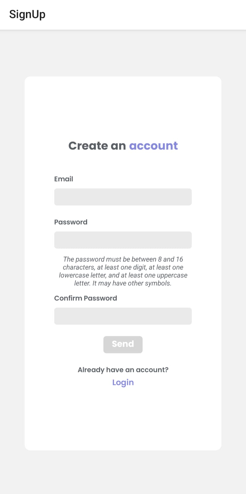...
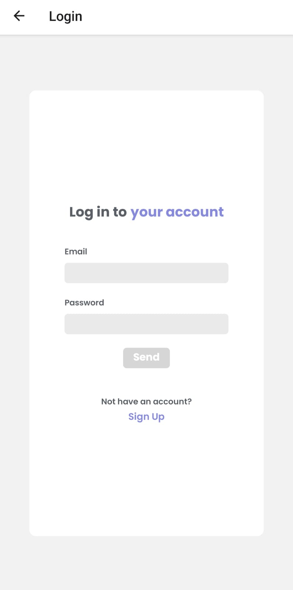


#### Tab Navigation: 
Gracias a **React navigation** podremos navegar en la applicación, en este caso tendremos cuatro posibles navegaciones principales:  
* Home: Listado de categorias, productos y detalle del producto.  
* Cart: En donde podremos visualizar los productos previamente añadidos.  
* Orders: Listado de las ordenes hechas por el usuario.  
* Perfil de usuario: Con tres posibles acciones. 

El código aplicado: 

```javascript
const TabNavigation = () => {
  return (
      <Tab.Navigator 
      screenOptions={{
        headerShown: false,
        tabBarShowLabel: false,
        tabBarStyle: styles.tabBar
      }}>
        <Tab.Screen 
          name="ShopStack" 
          component={ShopStack} 
          options={{
            tabBarIcon: ({focused}) => <AntDesign name="appstore1" size={24} title='lola' color={ focused ? colors.strongLilac : colors.strongGray} />
          }}/>
        <Tab.Screen 
          name="CartStack" 
          component={CartStack} 
          options={{
            tabBarIcon: ({focused}) => <MaterialIcons name="shopping-cart" size={24} color={ focused ? colors.strongLilac : colors.strongGray} />
          }}/>
         <Tab.Screen 
          name="OrderStack" 
          component={OrderStack} 
          options={{
            tabBarIcon: ({focused}) => <Octicons name="list-unordered"  size={24} color={ focused ? colors.strongLilac : colors.strongGray} />
          }}/> 
           <Tab.Screen 
          name="ProfileStack" 
          component={ProfileStack} 
          options={{
            tabBarIcon: ({focused}) => <FontAwesome5 name="user-alt" size={24} color={ focused ? colors.strongLilac : colors.strongGray} />
          }}/> 
      </Tab.Navigator>
  );}
```
Visualmente:  


#### Home: 
* Al ingresar se puede visualizar las categorias de los productos a seleccionar. Por ejemplo *Smartphones, groceries, laptops, etc.*    

* Cuando elegimos una de ellas podremos ver la **lista de productos** correspondientes a esa categoria. 

* Al seleccionar un producto, la pantalla muestra el detalle del mismo, con la posibilidad de agregarlo al carrito. Si se quiere agregar más de un item, sólo basta volver a presionar *'comprar'* . Si este se agrega exitosamente, un aviso saldrá en pantalla.

.

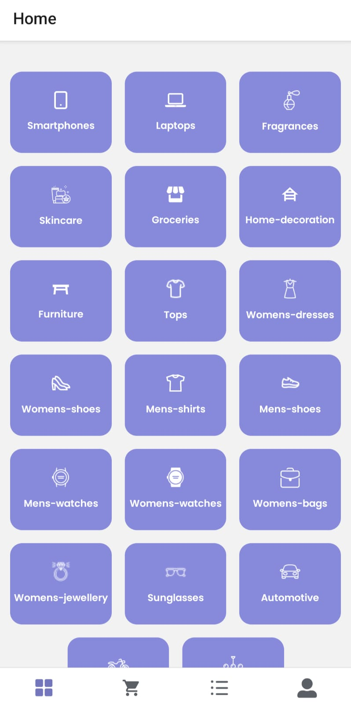 ..
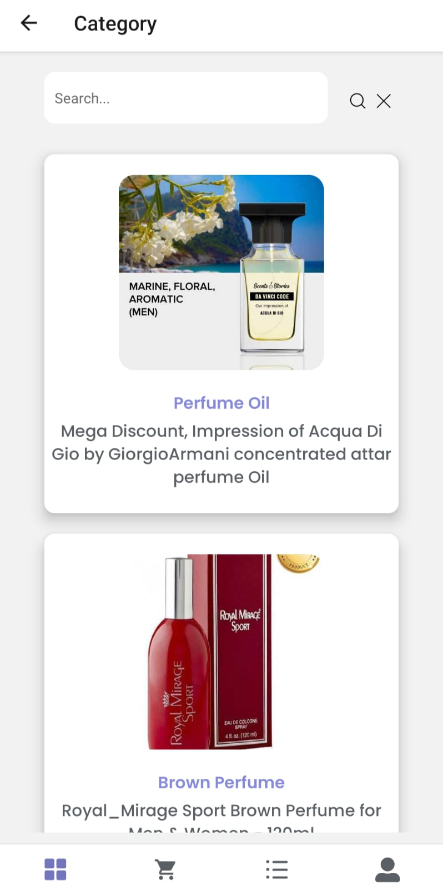...
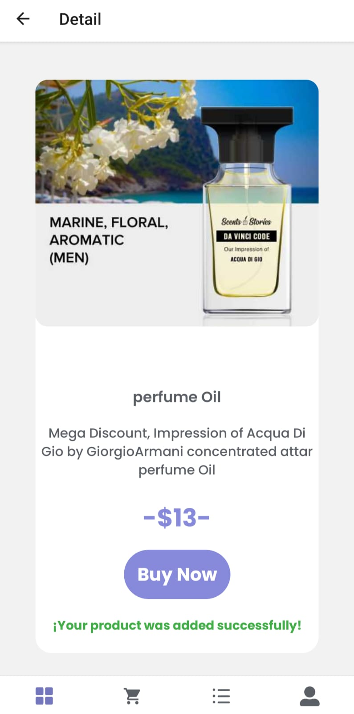


#### Cart:  
*  Listado de los productos que han sido agregados. Podremos ver qué producto es, su precio y cantidad seleccionada. 
* También puede ser eliminado facilmente mediante la cruz.  
* Por el momento la applicación no cuenta con una pasarela de pagos. Pero el carrito te permite crear una lista de compras para futuras referencias o para finalizar la compra
* Al confirmar la compra, se guardará como una orden. Si fue exitosa muestra un mensaje acorde y la pantalla navega directamente a **Orders**.  
* No se podrá enviar una orden vacia, es decir, sin productos. Se valida que el total siempre sea mayor a cero. 

 ...
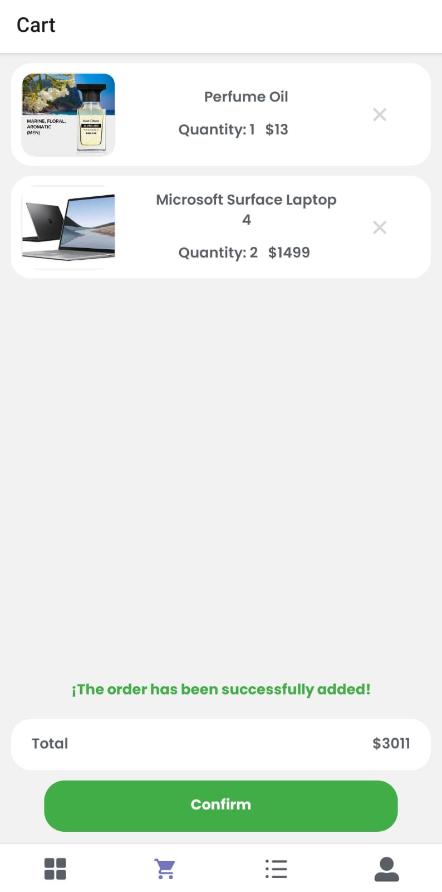   


#### Orders:  
* Listado de las ordenes, es decir, las listas de compras de cada usuario.  
* Cada item cuenta con la fecha de creación, monto y posibilidad de ver el detalle. 
* En el detalle se puede visualizar nombre, descripción, cantidad y precio de cada producto. 

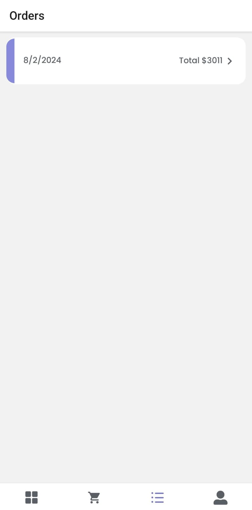 ...
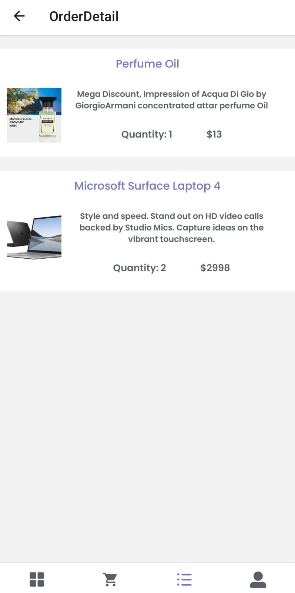  

#### Profile:  
* Gracias a Expo-Location y Expo-Picker-Image podemos acceder y gestionar las funcionalidades de Location
* Pantalla principal con imágen de usuario y ubicación.  
* Posibilidad de cambiar la imagen. Y visualizar con detalle la ubicación. 
* Boton de cerrar sesión. 


*(Imagenes con domicilio censurado para preservar.)*  
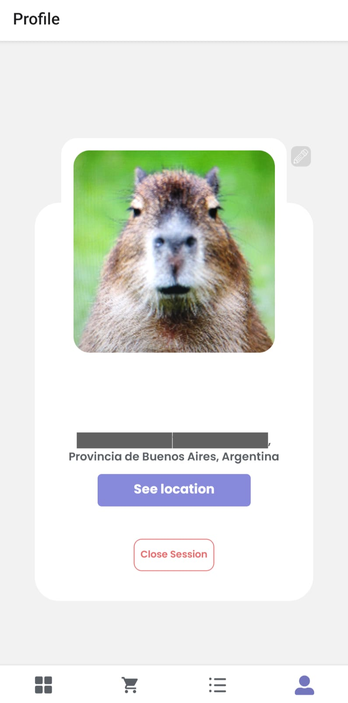 ...
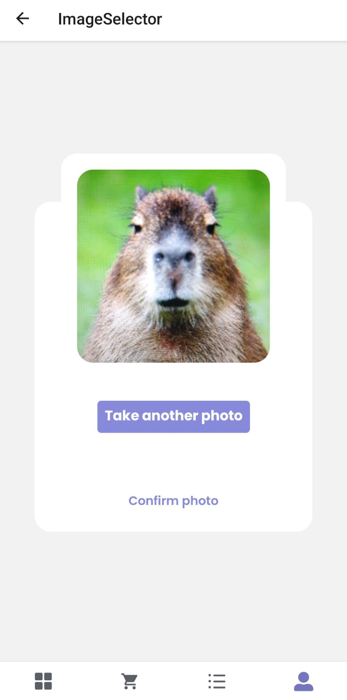 ... 
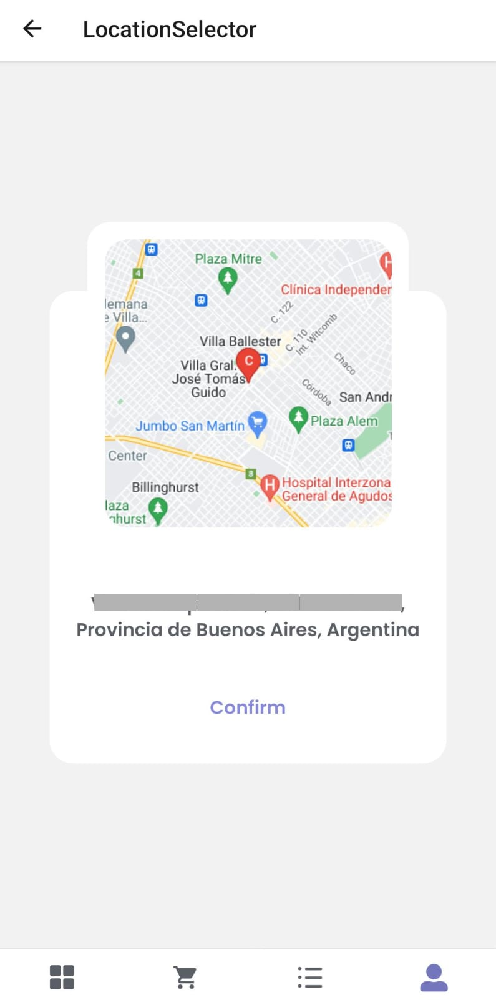 


----
## Instalación

1. Clona el repositorio: `git@github.com:Vickyrdz/e-commerce-react-native.git`
2. Instala las dependencias: `npm install`
3. Configura las claves de API para servicios externos (Expo-Location, Firebase, etc.).
4. Configura las credenciales de Firebase en tu proyecto.
5. Ejecuta la aplicación: `npm start`


## Contacto

Para preguntas o soporte: vickyrodriguez544@gmail.com.  

Linkedin: https://www.linkedin.com/in/victoriabelenrodriguez/  


